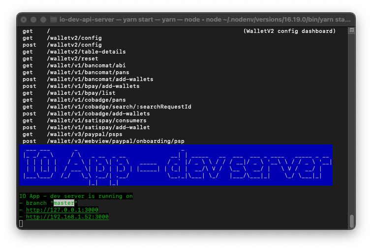
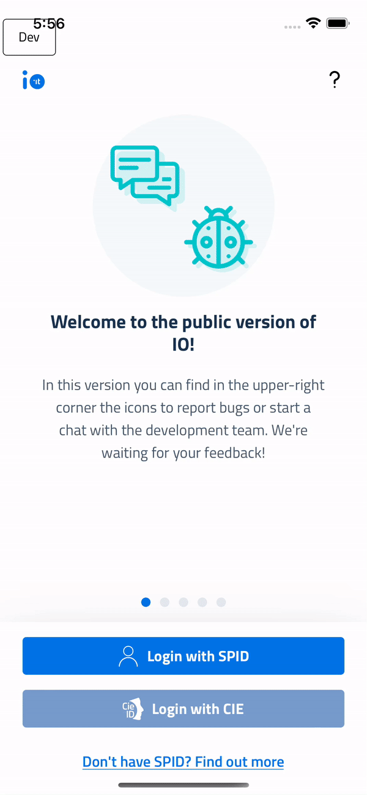

<h1 align="center">
  </a>
   
  IO dev API server
   
</h1>

<h4 align="center">Mock server of <a href="https://github.com/teamdigitale/io-backend">io-backend</a> for <a href=https://github.com/teamdigitale/io-app">io-app</a> development.</h4>

  

## Table of contents
* [Features](#features)
* [Local setup](#local-setup)
* [Docker setup](#docker-setup)
* [Usage with the app](#usage-with-the-app)

## Features
The test server has been created to make the app development process easier and more productive. Therefore you can:
- Run it on local machines without an internet connection;
- Change response payloads to test and stress the app;
- Add new paths and handlers to integrate and test features not yet released;
- Understand flows and data exchanged between app and backend.

   
Login

   The current login implementation by-passes SPID authentication: when the user asks for a login with a certain SPID Identity Provider, the server responses with a redirect containing the session token. The user will be immediately logged in.
     
   

   
Session

   When the client asks for a session, a valid session is always returned. Of course the developer could implement a logic to return an expired session response to test different scenarios.

## Local setup
The node version used in this project is stored in [.node-version](.node-version). 
We recommend the use of a virtual environment, nodenv is the chosen virtual environment for this guide, along with yarn for managing depencendices:
   1. Clone this repository and CD into it;
   2. Install dependencies by running `yarn install`;
   3. Generate API definitions by running `yarn generate`;
   4. Start the sterver by running `yarn start`.

Note: commands _**2**_ and _**3**_ should be executed on the first setup and only when io-backend specs change. The default port (3000) can be changed in the [server.ts](src/utils/server.ts) file.

## Docker setup
A docker image is also available for local dev purposes by following these simple steps:
   1. Install [docker](https://www.docker.com/get-started) on your system;
   2. Login into the github packages registry by running `docker login -u <YOUR_GITHUB_USERNAME> -p <GITHUB_TOKEN> docker.pkg.github.com`. You can follow [these instructions](https://help.github.com/en/packages/using-github-packages-with-your-projects-ecosystem/configuring-npm-for-use-with-github-packages) for further assistance;
   3. Point your browser to `https://github.com/pagopa/io-dev-api-server/packages` and choose the package version (namely `<CHOSEN_PACKAGE_VERSION>`) you are looking for. We recommend using the latest version;
   4. Copy the `docker pull...` command and paste it into your terminal;
   5. After the docker daemon finishes downloading the image, run this command: `docker run -d -p <YOUR_HOST_PORT>:3000 docker.pkg.github.com/pagopa/io-dev-api-server/io-dev-api-server:<CHOSEN_PACKAGE_VERSION>`
   6. The server should be running at `http://127.0.0.1:<YOUR_HOST_PORT>/`.

## Usage with the app
   1. Run the server, either locally on via Docker;
   2. In the app project folder run `cp .env.local .env` (it is configured with a server running in the same machine of the device, you can edit the server endpoint on your needs);
   3. Run the app `yarn run-ios` or `yarn run-android`;