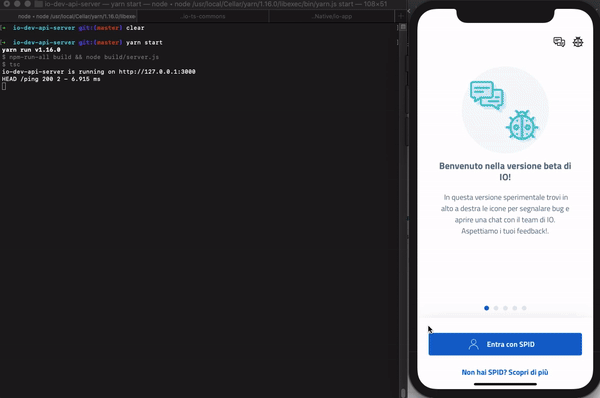
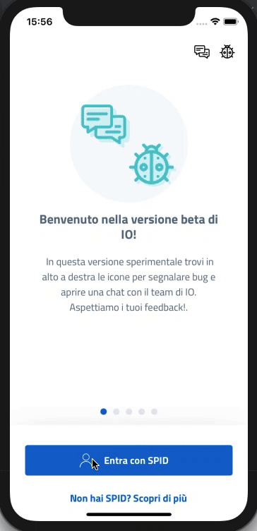
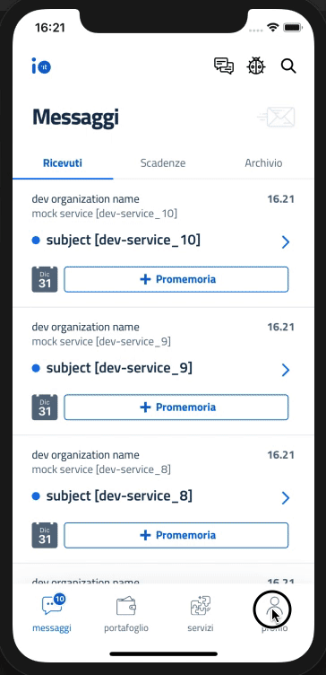

# IO dev API server

It's a simple mock server of [io-backend](https://github.com/teamdigitale/io-backend) for [io-app](https://github.com/teamdigitale/io-app). 
It has been created to make the app development process easier and more productive. 
With this local server the developer can: 

- **run it on local machine** (no internet connection needed)
- **change response payloads** to test and stress the app
- **add new paths and handlers** to integrate and test features not yet released
- **understand flows and data exchanged** between app and backend

### Installation

On macOS and Linux we recommend the use of nodenv for managing multiple versions of NodeJS.
The node version used in this project is stored in [.node-version](.node-version).

#### Setup

1. clone this repository
1. install all packages needed: 
   `yarn install`
1. generate API definitions: 
   `yarn generate:all`
1. you are ready! start the server: 
   `yarn start`

Commands _**2**_ and _**3**_ should be executed on the first setup and only when io-backend specs change

#### Docker setup

A docker image is also available for local dev purposes by following these simple steps:

1. Be sure you have [docker](https://www.docker.com/get-started) installed on your system
1. login into the github packages registry by running `docker login -u <YOUR_GITHUB_USERNAME> -p <GITHUB_TOKEN> docker.pkg.github.com` (The configuration is pretty simple and fast, you can follow [these instructions](https://help.github.com/en/packages/using-github-packages-with-your-projects-ecosystem/configuring-npm-for-use-with-github-packages))
1. point your browser to: https://github.com/pagopa/io-dev-api-server/packages and choose the package version (namely `<CHOSEN_PACKAGE_VERSION>`) you are looking for. Please note that latest version is recommended.
1. copy the Pull image from the command line and paste it into a terminal
1. after docker daemon finish to download image run this command: `docker run -d -p <YOUR_HOST_PORT>:3000 docker.pkg.github.com/pagopa/io-dev-api-server/io-dev-api-server:<CHOSEN_PACKAGE_VERSION>`
1. enjoy **io-dev-api-server** on `http://127.0.0.1:<YOUR_HOST_PORT>/`

#### Run [IO-App](https://github.com/teamdigitale/io-app) with this server

1. run the server `yarn start`
1. in the app project folder run `cp .env.local .env` (it is configured with a server running in the same machine of the device. You can edit the server endpoint on your needs)
1. run `yarn postinstall` (update config file injected into the app)
1. run the app `yarn run-ios` or `yarn run-android`

> you could edit the [server port](server.ts) (**serverPort** - default is 3000)

#### Login

The current login implementation by-passes SPID authentication: when the user asks for a login with a certain SPID Identity Provider, the server responses with a redirect containing the session token. The user will be immediately logged in.

#### Session

When the client asks for a session, a valid session is always returned. Of course the developer could implement a logic to return an expired session response to test different scenarios.

#### Profile

The profile is [mocked](payloads/profile.ts) (hard-coded). If you want the server reponses a different profile, just edit it!
 On upsert profile request the server acts like a mirror: it gives back the updated profile (sent by the client) increasing the profile version

